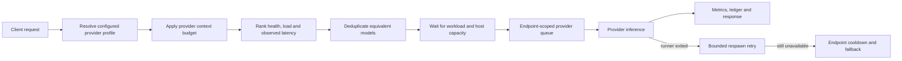
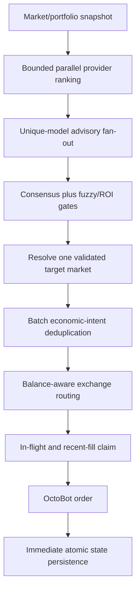

# Inference and Trading Reliability Workflow

This document describes Gail's context budgeting, load-shedding, local-provider
recovery, trading request deduplication, and state durability workflow. These
controls were introduced after a 24-hour production audit found that most LLM
failures were deterministic context/capacity failures and that exchange-level
decisions could converge on duplicate orders after balance-aware rerouting.

## Reliability invariants

Gail enforces the following invariants:

1. A provider request is compacted before it occupies network or inference
   capacity when its estimated input exceeds the provider context window.
2. Equivalent models are not invoked twice in one normal orchestration wave or
   trading advisory round. `fastest` mode is the explicit exception because its
   contract is to race endpoint replicas.
3. Provider/host capacity waits are bounded and event-driven. Waiting does not
   block a Tokio worker and does not create a polling loop.
4. Ollama concurrency is limited per endpoint, allowing independent machines to
   run in parallel without overcommitting any single machine.
5. One market-level trading consensus can create at most one market action.
6. Equivalent buy intents are exchange-independent because rerouting can move
   several source-market decisions to the same funded account.
7. A filled order is persisted immediately and atomically before another cycle
   can rely on its cooldown or ROI history.

## Inference workflow



### Context budgeting

`src/prompt_budget.rs` is transport-independent and is called by both direct and
orchestrated completion paths.

- `providers[].context_window_tokens` is authoritative when configured.
- Local Ollama and local/private OpenAI-compatible endpoints use
  `orchestration.default_local_context_window_tokens` when no explicit value is
  present.
- The requested output allowance and `prompt_safety_margin_tokens` are reserved
  before computing the available input budget.
- System policy is retained with a bounded share of the context.
- Newest messages are retained first.
- Omitted history is replaced with a deterministic summary containing omitted
  message, role, character and estimated-token counts.
- A single oversized message is shortened in the middle, retaining its opening
  objective and latest trailing context.

The compactor deliberately does not call another LLM. A summarisation request
would consume the same saturated capacity and introduce another failure path.

### Candidate deduplication and endpoint selection

Two identities are used intentionally:

- Attempt identity includes provider, model and endpoint. It allows a later
  fallback wave to try another host after the first host fails.
- Model-work identity includes provider and model but excludes endpoint. It
  prevents equivalent work from running concurrently in a normal wave.

Trading always deduplicates by model-work identity. Among equivalent endpoints,
it reuses Gail's live routing score, which includes health, NMC pressure,
resource saturation, recent usage, latency and queue telemetry. This allows a
faster endpoint such as qc02 to win without issuing the same advisory to qc00,
qc02 and qc03 simultaneously.

`selection_mode: fastest` retains replica racing because callers explicitly ask
for lowest observed response time. `best` and `round_robin` avoid duplicate
model work.

### Backpressure and parallelism

There are three bounded concurrency layers:

1. Workload pools isolate interactive/trading work from solver work.
2. Provider and shared-host resource reservations enforce configured CPU, RAM,
   VRAM and request limits.
3. Ollama endpoint semaphores enforce local generation concurrency independently
   for each base URL.

When a provider/host reservation is unavailable, tasks await a Tokio `Notify`
event until `candidate_queue_wait_timeout_ms`. Releasing capacity wakes waiters.
No OS thread or Tokio worker is blocked.

Ollama queue time is measured separately from inference time and returned in
local usage telemetry. Endpoint saturation causes endpoint-local cooldown and
fallback; it does not idle unrelated Ollama hosts.

### Ollama runner recovery

The messages `llama-server process no longer running`, `runner process has
terminated`, and `runner process exited` identify a runner failure rather than a
bad prompt. Gail:

1. waits for `GAIL_OLLAMA_RUNNER_RESTART_BACKOFF_MS` (750 ms by default),
2. retries once within the original endpoint/request deadline,
3. cools down the failed endpoint and tries a fallback if the retry fails.

The overall timeout is not increased. This preserves trading-data freshness.

## Trading workflow



### One consensus, one target

A consensus built from a collection of markets is not copied onto every market
row. Gail resolves one target using provider `target_symbol` support, live market
availability, direction, portfolio holdings and the effective trade floor.
Unresolvable high-confidence targets are converted to `hold` rather than being
executed against a fallback symbol with an unrelated rationale.

Discovery and pruning remain symbol-specific. Their independent Refiner and LLM
calls use `buffer_unordered` with
`trading.max_parallel_symbol_evaluations`, providing bounded parallelism without
serial head-of-line delay.

### Economic intent keys

Deduplication happens twice: once before execution and once immediately before a
mutating OctoBot request.

| Action | Intent key | Reason |
| --- | --- | --- |
| Buy / strong buy | `BUY\|SYMBOL` | Different source exchanges may reroute to the same funded account. |
| Sell / strong sell | `SELL\|EXCHANGE\|SYMBOL` | Separate exchange holdings may legitimately require separate reductions. |

The runtime claim rejects an equivalent in-flight request and an equivalent fill
within `min_trade_interval_seconds`. Explicit operator overrides may repeat a
recent fill, but never collide with an in-flight order.

### Durable state

Trading state is persisted:

- immediately after every filled order,
- after the primary evaluation,
- after maintenance/backtest work,
- during graceful shutdown.

Persistence writes a unique temporary sibling file and atomically renames it
over the target. A process failure therefore leaves either the previous complete
snapshot or the new complete snapshot, not a partially written JSON document.
In-flight claims are intentionally runtime-only; filled trades are the durable
cross-restart deduplication record.

## Configuration reference

| Setting | Default | Purpose |
| --- | ---: | --- |
| `orchestration.prompt_compaction_enabled` | `true` | Compact oversized inputs before dispatch. |
| `orchestration.default_local_context_window_tokens` | `16384` | Fallback context for local endpoints. |
| `orchestration.prompt_chars_per_token` | `4` | Conservative token estimate. |
| `orchestration.prompt_safety_margin_tokens` | `1024` | Chat-template/tokeniser safety reserve. |
| `providers[].context_window_tokens` | unset | Explicit per-provider/model context. |
| `orchestration.deduplicate_model_candidates` | `true` | Avoid equivalent model work in normal waves. |
| `orchestration.workload_pool_wait_timeout_ms` | `30000` | Global workload-pool wait. |
| `orchestration.candidate_queue_wait_timeout_ms` | `30000` | Provider/host reservation wait. |
| `trading.max_parallel_symbol_evaluations` | `2` | Bounded discovery/pruning parallelism. |
| `trading.min_trade_interval_seconds` | `120` | Recent equivalent-fill cooldown. |

Environment overrides are available as
`GAIL_PROMPT_COMPACTION_ENABLED`, `GAIL_LOCAL_CONTEXT_WINDOW_TOKENS`,
`GAIL_PROMPT_CHARS_PER_TOKEN`, `GAIL_PROMPT_SAFETY_MARGIN_TOKENS`,
`GAIL_DEDUPLICATE_MODEL_CANDIDATES`,
`GAIL_CANDIDATE_QUEUE_WAIT_TIMEOUT_MS`, and
`GAIL_OLLAMA_RUNNER_RESTART_BACKOFF_MS`.

## Operational verification

After deployment, verify:

1. `compacted oversized provider prompt before dispatch` appears instead of
   upstream context-overflow errors for oversized histories.
2. Trading advisory rounds contain only one endpoint for each provider/model.
3. qc02/qc03 can show simultaneous inference while each endpoint respects its
   own concurrency limit.
4. `duplicate_intents_dropped` remains visible in decision log context and no
   cross-exchange duplicate buys reach OctoBot.
5. Every successful `order placed` record is present in `trading_state.json`
   immediately, without waiting for five evaluations.
6. Evaluation duration approaches the slowest bounded symbol/advisor group
   instead of the sum of all symbol timeouts.

Run the CI-safe regression suite with:

```bash
cargo test --locked --lib --no-default-features --features ci-trading-tests
```
